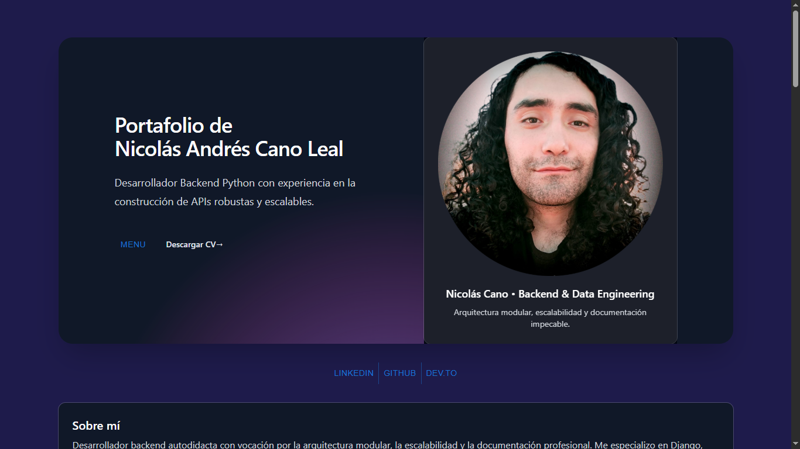

# 💻 Portafolio Frontend – React + Vite + TailwindCSS

Este proyecto representa la interfaz moderna y desacoplada de mi portafolio técnico como Backend Developer, desarrollado con **React**, **Vite** y **TailwindCSS**. Se conecta a una API REST construida con Django/DRF y expone mis proyectos, habilidades y formulario de contacto.

> 🎯 Este frontend reemplaza la versión anterior basada en Django Templates.
> ✅ Totalmente modular, visualmente refinado y listo para producción.

---

## 🚀 Tecnologías utilizadas

| Herramienta     | Uso principal                                |
|-----------------|----------------------------------------------|
| **React**       | Construcción de interfaz interactiva         |
| **Vite**        | Bundler moderno para desarrollo rápido       |
| **TailwindCSS** | Estilos responsivos y personalizados         |
| **MUI**         | Íconos y componentes visuales accesibles     |
| **Shadcn/UI**   | Adaptación de Tailwind v4 con PostCSS        |

---

## 🧩 Componentes clave

- `ProjectCard.jsx`: muestra proyectos con imagen, descripción y enlaces
- `SkillCard.jsx`: representa habilidades con íconos personalizados
- `ContactCard.jsx`: formulario visual con envío a backend Django/DRF
- `FooterCard.jsx`: enlaces a redes sociales, incluyendo CV descargable
- `BasicMenu.jsx`: navegación interactiva con MUI
- `SobreMi.jsx`: presentación personal editable desde frontend

---

## 🌐 Conexión con el Backend

Este frontend se conecta al backend a través de los siguientes endpoints:

- `GET /api/projects/` → muestra proyectos
- `GET /api/skills/` → muestra habilidades
- `POST /api/contacto/` → envía mensaje del formulario de contacto

La variable `VITE_API_BASE_URL` se configura en `.env` para consumir la API correctamente.

---

## 📸 Vista referencial del portafolio



---

## ⚙️ Instalación del proyecto

```bash
git clone https://github.com/NicolasAndresCL/Portafolio-Frontend-React.git
cd Portafolio-Frontend-React
npm install
npm run dev     # Desarrollo local
npm run build   # Compilar para producción
```

## 🧠 Ajustes importantes para Tailwind v4

- Uso de postcss.config.cjs con @tailwindcss/postcss

- Configuración de tailwind.config.js para React/Vite

- Estilos base definidos en index.css

- Plugins adaptados para compatibilidad moderna

## 📄 Notas de despliegue

Este frontend aún no tiene integración automática CI/CD. La versión anterior del portafolio está desplegada en PythonAnywhere, únicamente con Django Templates.

Este nuevo frontend será vinculado manualmente al backend y subido a producción, reemplazando la versión anterior.

## 🐛 Debugging real en producción Django + React
🔍 1. Pantalla en blanco tras integración de frontend
Síntoma: Vista en blanco sin errores visibles en consola.

Diagnóstico:

Archivos hashificados duplicados en STATIC_ROOT.

index.html mal referenciado o sin ruta estática adecuada.

Assets no linkeados correctamente por manifest.json post-build.

Solución aplicada:

Limpieza de STATIC_ROOT + regeneración de assets vía npm run build.

Validación manual de rutas en HTML y revisión de settings.py.

Verificación de collectstatic y compatibilidad con STATICFILES_DIRS.

## ⚠️ 2. Error MIME en entorno móvil
Síntoma: Estilos no cargan en dispositivos móviles, consola marca error MIME.

Diagnóstico:

Improper MIME type debido a ruta errónea o archivo vacío.

Confusión entre STATICFILES_DIRS (desarrollo) y STATIC_ROOT (producción).

Solución aplicada:

Revisión de cabeceras en archivos CSS y JS.

Rebuild del frontend asegurando .map y .css válidos.

Ajuste en configuración de Nginx/Gunicorn para servir estáticos correctamente.

## 🖼️ 3. Problemas de visibilidad UX/UI en móvil
Síntoma: Tarjetas invisibles, texto sin contraste en ciertas resoluciones.

Diagnóstico:

Estilos heredados no aplican correctamente en media queries.

Diferencias en layout y z-index por falta de breakpoints específicos.

Solución aplicada:

Refactor con min-width y max-width en breakpoints claves.

Uso de unidades relativas (em, %) para adaptar espaciado.

Validación visual multiplataforma con inspección móvil en DevTools.

## 🤝 Contribuciones
Las mejoras visuales, ajustes responsivos o nuevas secciones son bienvenidas. Abrí un issue o enviá un pull request.

## 🧾 Licencia
Este proyecto está bajo licencia MIT.