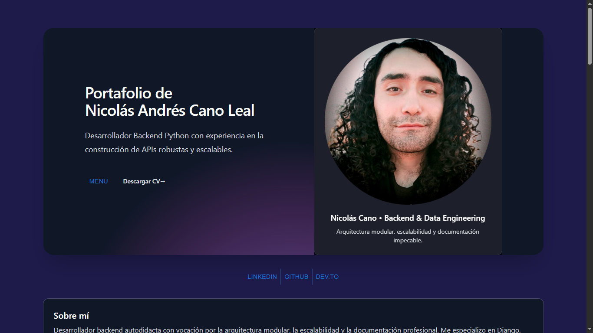

# Portafolio Frontend — React + Vite + Stitches + Radix UI

Interfaz moderna y desacoplada de mi portafolio técnico. Construida con **React 19**, **Vite 7**, **Stitches** y **Radix UI Themes**, se conecta a una API REST Django/DRF y presenta mis proyectos, habilidades y formulario de contacto funcional.

El sistema de diseño sigue una paleta inspirada en **VSCode Dark+**, con tokens semánticos (`$syntaxFunction`, `$syntaxString`, `$accent`, etc.) aplicados de forma consistente en todos los componentes.

---

## Stack

| Herramienta | Uso |
|---|---|
| **React 19** | Componentes y estado de la UI |
| **Vite 7** | Bundler, dev server y build de producción |
| **Stitches** | CSS-in-JS con tokens semánticos |
| **Radix UI Themes** | Componentes accesibles y sistema de layout |
| **Axios** | Consumo de la API REST del backend |
| **Vitest + RTL** | Tests unitarios de componentes |

---

## Estructura de componentes

```
src/
├── components/
│   ├── ui/                  # Primitivos reutilizables (Button, Card, Input)
│   ├── TituloCard.jsx       # Hero: nombre, headline, avatar, CV, navegación
│   ├── SobreMi.jsx          # Sección sobre mí
│   ├── CarruselProjects.jsx # Carrusel de proyectos destacados
│   ├── ProjectCard.jsx      # Tarjeta individual de proyecto
│   ├── SkillsCarousel.jsx   # Carrusel de habilidades
│   ├── SkillCard.jsx        # Tarjeta individual de habilidad
│   ├── ContactCard.jsx      # Formulario de contacto conectado a la API
│   ├── FooterCard.jsx       # Pie de página con redes sociales
│   └── BasicMenu.jsx        # Menú de navegación accesible
├── tests/
│   ├── setup.js
│   └── ContactCard.test.jsx # 7 tests: render, envío, feedback, errores
├── App.jsx                  # Fetch de datos + manejo de loading/error
├── main.jsx                 # Entry point con providers
└── stitches.config.js       # Tokens de diseño VSCode Dark+
```

---

## Variables de entorno

Crea un archivo `.env` en la raíz del frontend (ver `.env.example`):

```bash
VITE_API_BASE_URL=http://localhost:8000
```

En producción usa:

```bash
VITE_API_BASE_URL=https://nicolasandrescl.pythonanywhere.com
```

---

## Correr en local

```bash
# Instalar dependencias
npm install

# Modo desarrollo (requiere backend corriendo en :8000)
npm run dev
```

El frontend queda disponible en **http://localhost:5173**.

---

## Tests

```bash
# Correr tests una vez
npm test

# Modo watch (re-corre al guardar)
npm run test:watch

# Con reporte de cobertura
npm run test:coverage
```

Suite actual: **7 tests** sobre `ContactCard` — render, actualización de campos, estado de carga, mensaje de éxito, mensaje de error, payload correcto a la API, y rehabilitación del botón.

---

## Build de producción

```bash
npm run build
```

El build se genera directamente en `../../backend/MiPortafolioDjango/static/frontend/dist/` junto con el manifest de Vite para que Django resuelva los nombres de assets hasheados automáticamente.

---

## Conexión con el Backend

| Endpoint | Acción |
|---|---|
| `GET /api/projects/` | Carga proyectos en el carrusel |
| `GET /api/skills/` | Carga habilidades en el carrusel |
| `POST /api/contacto/` | Envía mensaje del formulario de contacto |

---

## CI/CD

GitHub Actions en `.github/workflows/ci.yml`:
- Instala dependencias con `npm ci`
- Corre los 7 tests con Vitest
- Genera el build de producción con `VITE_API_BASE_URL` desde secrets
- Sube el artefacto `dist/` por 7 días

**Secret requerido en GitHub:** `VITE_API_BASE_URL`

---

## Vista referencial



---

**Nicolás Andrés Cano Leal**
LiveOps & BizOps | Python Backend Developer | Data Automation
